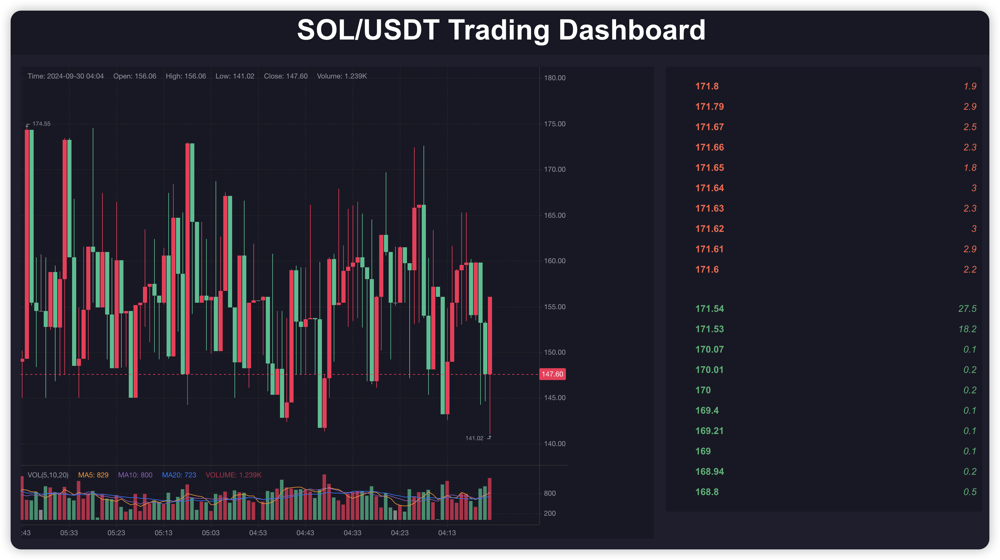

# SOL/USDT Trading Dashboard

For Trireme trading technical assessment.



This project is a **SOL/USDT Trading Dashboard** designed to demonstrate real-time trading data from Bybit's API. The dashboard provides two key features:

1. **Candlestick Chart**: Displays live trading data in the form of a candlestick chart.
2. **Order Book**: Displays live bid/ask prices from the Bybit exchange.

The project is built using:

- **Backend**: Spring Boot (Java)
  - Uses Bybit's official Java SDK to fetch data.
  - Candlestick data broadcasts at 60 second intervals.
  - Order book data broadcasts at 5 second intervals.
- **Frontend**: React
  - Displays the candlestick chart and order book using WebSocket connections to the backend.
  - Frontend is pushed to another repo, click [here](https://github.com/jkmeansesc/trireme-frontend.git).

---

## Prerequisites

To run this project locally, you’ll need the following installed on your machine:

1. **Java 11**
2. **Maven**
3. **Node.js**
4. **npm**

---

## Running the Project Locally

### Step 1. Setup the back-end

```bash
git clone https://github.com/jkmeansesc/Trireme.git
```

1. Import this repository into the IDE of your choice as a Maven project.
2. In your IDE, simply run `SolusdtappApplication`.

> As soon as you run the application, the broadcasts will start.

### Step 2: Setup the front-end

```bash

git clone https://github.com/jkmeansesc/trireme-frontend.git
cd trireme-frontend
npm install
npm start
```

The React app will start at `http://localhost:3000`.
